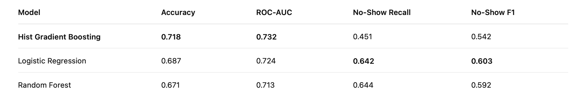

# EDA_HotelNoShowPrediction
EDA Assessment - Hotel No Show Prediction

📊 Exploratory Data Analysis (EDA)

Dataset Overview

The dataset contains 119,390 hotel booking records after cleaning, with the target variable:
	•	no_show:
	•	1 → Customer did not show up
	•	0 → Customer showed up

The dataset includes booking details such as:
	•	Booking and arrival dates
	•	Customer demographics (country, first-time indicator)
	•	Booking channel (platform)
	•	Room type and price
	•	Number of guests

Key Observations

1. Class Distribution
	•	Show (0): ~63%
	•	No-Show (1): ~37%

This indicates a moderate class imbalance, which influences model evaluation:
	•	Accuracy alone is insufficient
	•	Metrics like ROC-AUC, Recall, and F1-score are more appropriate

⸻

2. Pricing Patterns
	•	Prices required cleaning due to mixed currency formats (USD/SGD)
	•	Converted all prices to SGD for consistency
	•	Higher prices generally correlate with lower no-show probability, suggesting stronger commitment

⸻

3. Booking Behavior
	•	Lead time (time between booking and arrival) is a strong indicator:
	•	Longer lead times → higher likelihood of no-show
	•	Stay duration also affects behavior:
	•	Short stays are slightly more prone to no-shows

⸻

4. Customer Characteristics
	•	First-time customers show higher no-show rates compared to returning customers
	•	Booking platform plays a significant role:
	•	Some platforms have systematically higher no-show rates

⸻

5. Feature Engineering Insights

To improve predictive power, several features were engineered:
	•	lead_time_days → booking window
	•	stay_length_days → duration of stay
	•	total_guests → party size
	•	price_sgd → standardized pricing
	•	price_per_guest → normalized cost signal
	•	Behavioral indicators:
	•	weekend_arrival
	•	is_peak_season
	•	is_family
	•	Interaction features:
	•	first_time_weekend
	•	platform-based combinations

These features capture customer intent, commitment level, and booking patterns, which are critical for predicting no-shows.

⸻

🤖 Model Development & Evaluation

Models Evaluated

Three machine learning models were implemented:
	1.	Logistic Regression
	2.	Random Forest
	3.	HistGradientBoosting (best performing)

⸻

Performance Comparison

Model Selection Rationale

✅ Selected Model: HistGradientBoosting

HistGradientBoosting was selected as the final model because:
	•	It achieved the highest ROC-AUC (0.732)
	•	Better at ranking customers by no-show probability
	•	Handles nonlinear relationships and feature interactions effectively
	•	More robust for tabular data compared to linear models

⸻

⚠️ Important Trade-Off

Although HistGradientBoosting performs best overall:
	•	Logistic Regression has higher recall for no-shows (0.642 vs 0.451)

This means:
	•	Logistic Regression detects more actual no-shows
	•	HistGradientBoosting misses more no-shows but provides better probability ranking

⸻

💼 Business Interpretation

From a business perspective:
	•	A false negative (predicting show but customer is a no-show) leads to:
	•	Lost revenue
	•	Inefficient room allocation

Therefore:
	•	If the goal is maximizing detection of no-shows → Logistic Regression may be preferred
	•	If the goal is ranking customers by risk for decision-making (e.g., overbooking strategy) → HistGradientBoosting is more suitable

⸻

📈 Model Limitations
	•	ROC-AUC stabilizes around ~0.73, suggesting:
	•	The dataset has limited predictive signal
	•	Further gains require:
	•	Additional external features (e.g., customer history, cancellation policy)
	•	More advanced models (e.g., LightGBM/XGBoost)

⸻

🚀 Future Improvements

Potential improvements include:
	1.	Hyperparameter tuning with larger search space
	2.	Threshold optimization to reduce false negatives
	3.	Advanced models (LightGBM / XGBoost)
	4.	Richer feature engineering, including:
	•	Customer booking history
	•	Seasonal demand patterns
	•	Platform-specific behavioral trends

⸻

✅ Conclusion
	•	A complete ML pipeline was developed from raw SQLite data to model evaluation
	•	HistGradientBoosting achieved the best overall performance (ROC-AUC: 0.732)
	•	Logistic Regression demonstrated stronger recall for no-show detection
	•	Final model choice depends on business objective and risk tolerance
